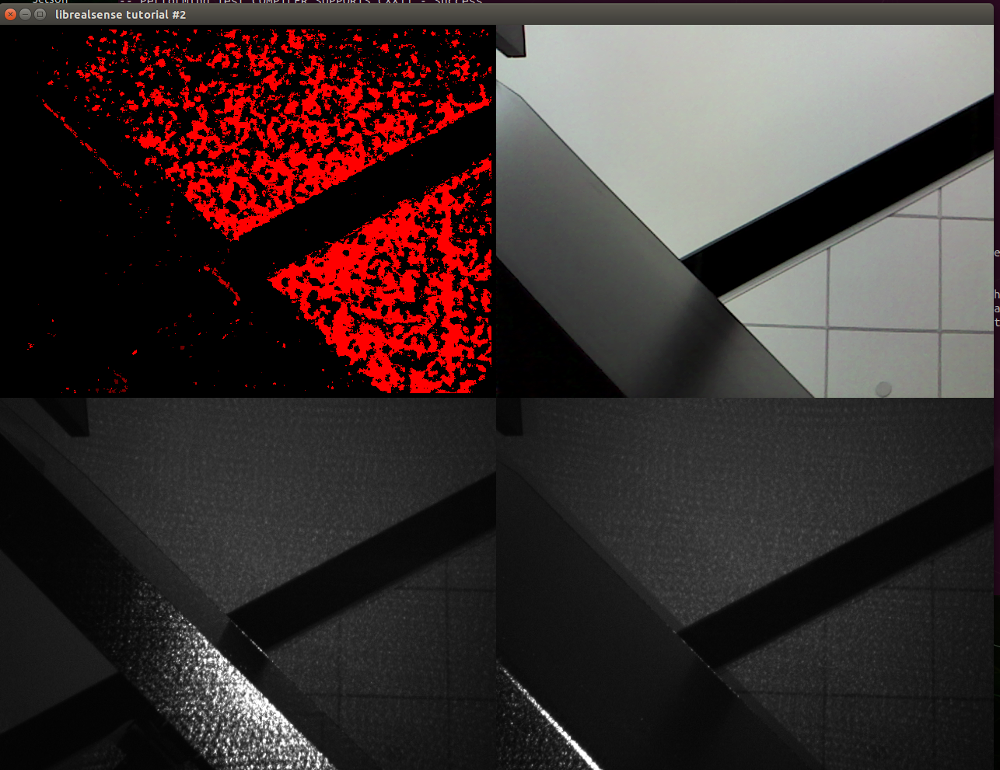

+++
title = '06032024_r200_cam_on_TX2'
date = 2024-06-04T17:44:06-07:00
draft = false
+++

# RealSense R200 Camera on Jetson TX2 with L4T R32.3.1

Both RealSense R200 camera and NVidia Jetson TX2 are considered legacy hardwares today (when this post is written at June, 2024) and are replaced by their newly released siblings that are more capable and fancier. However, I happen to have both and it is a pitty to have them collect dust on shelf, thus the effort. 


## Jetpack and L4T versions
* For some practical reason (I only got Auvidea J120 TX2 carrier board patching [firmware v3.0](https://auvidea.eu/download/firmware/J120/J90-J120-J130_4_3.tar.bz2), released on Feb 2020, working with JP4.3; the latest J120 v4.0 firmware released on Dec 2021 doesn't work for me on JP4.6/L4T32.6.1), I chose [Jetpack 4.3](https://developer.nvidia.com/jetpack-33-archive) and [L4T32.3.1](https://developer.nvidia.com/l4t-3231-archive) as the starting point on Jetson TX2. 
* This post talks about getting everything work on Jetson TX2 development kit, **not** on J120 carrier board though. 
* As a note for completeness, Jetson TX2 latest SDK is [Jetpack 4.6.4](https://developer.nvidia.com/jetpack-sdk-464), which couples with [L4T 32.7.4](https://developer.nvidia.com/embedded/linux-tegra-r3274). 


## RealSense R200 SDK/Library

The latest SDK/library that supports the legacy RealSense R200 camera is [v1.12.4](https://github.com/IntelRealSense/librealsense/tree/v1.12.4), which seems a final release following the earlier said "final" release [v1.12.1](https://github.com/IntelRealSense/librealsense/tree/v1.12.1). 

These blogs are good references:

* Running the RealSense R200 camera with librealsense and pyrealsense legacy libraries: [link](https://idorobotics.com/2020/01/02/running-the-realsense-r200-camera-with-librealsense-and-pyrealsense-legacy-libraries/).
* Intel librealsense installation [doc](https://github.com/IntelRealSense/librealsense/blob/development/doc/installation.md#install-librealsense2), which was written for librealsense v2.0, however, this section works for v1.12.x which supports realsense R200. 


## Patch on Jetson TX2 directly

(Not repeat all the details here, only for guidance, mileage varies if followed exactly below...)

On a freshly flashed TX2, follow the guidance listed on [Intel librealsense installation](https://github.com/IntelRealSense/librealsense/blob/development/doc/installation.md#install-librealsense2):

* Clone librealsense2. 
```
git clone https://github.com/IntelRealSense/librealsense.git
```
As of when this blog is being written, this commit is used:
```
commit ff8a9fb213ec1227394de4060743b0ed61171985 (HEAD -> master, origin/master, origin/HEAD)
Merge: 4673a37d9 488c6ec3e
Author: Eran <librealsense.eran@gmail.com>
Date:   Sun Apr 21 12:01:57 2024 +0300

    PR #12864: Merge v2.55.1 to master

```
* Run permissions script from librealsense2 tot directory.
```
./scripts/setup_udev_rules.sh
```

* Build and apply patched kernel modules.
```
./scripts/patch-realsense-ubuntu-L4T.sh
```

## Build Linux kernel from source on x86 host

The patching process can be done on Jetson TX2 itself (maybe simpler in that way as well) after flashing it with NVidia SDKManager with the right version of L4T mentioned above. However, since I'm considering deploy Yocto onto the same platform as a later step, it is better to start with x86 host patching. 

Good advices about building kernel from source on x86 host for Jetson platform:

* Auvidea J120 and Intel RealSense D435: [link](https://forums.developer.nvidia.com/t/auvidea-j120-and-intel-realsense-d435/64999/8)
* TX2i WiFi support (the title is irrelevant but the message pointed to is good reference about general kernel compile from source): [link](https://forums.developer.nvidia.com/t/tx2i-wifi-support/63839/2)

General L4T Kernel Customization [reference](https://docs.nvidia.com/jetson/archives/l4t-archived/l4t-3231/index.html?_gl=1*18jb7bx*_gcl_au*OTUwNjIzMDg4LjE3MTYyMjg0MTU.#page/Tegra%2520Linux%2520Driver%2520Package%2520Development%2520Guide%2Fkernel_custom.html%23wwpID0E02C0HA) from official documentation of L4T. 

### Prerequesites
* Since we are building for a legacy system, Ubuntu 18.04 LTS is needed on x86. 
```
$ lsb_release -a
No LSB modules are available.
Distributor ID:	Ubuntu
Description:	Ubuntu 18.04.6 LTS
Release:	18.04
Codename:	bionic
```

* A ```.config``` is preferred to be copied and saved from a freshly flashed TX2 to be used in later source compilation. How and why [here](https://forums.developer.nvidia.com/t/tx2i-wifi-support/63839/2). 

* Install cross-compile toolchain, following [Jetson Linux Driver Package Toolchain](https://docs.nvidia.com/jetson/archives/l4t-archived/l4t-3231/index.html#page/Tegra%20Linux%20Driver%20Package%20Development%20Guide/xavier_toolchain.html) to install necessary tools. 

* Sync down the earlier mentioned librealsense git repository as mentioned in [Patch on Jetson TX2](#patch-on-jetson-tx2). 

### Compile
* Get L4T source code by using source_sync.sh, which can be downloaded from ```~/nvidia/nvidia_sdk/JetPack_x.y.z_Linux_JETSON_TX2_TARGETS/Linux_for_Tegra/source_sync.sh``` if you ever have flashed the system using SDKManager (you should have). Using this official script is easier to make sure downloaded sources are complete with matching versions of each subdirectories etc. 
```
mkdir -p ~/tx2_source_build/r32-3-1_Release_v1.0
cd ~/tx2_source_build/r32-3-1_Release_v1.0
./source_sync.sh -k tegra-l4t-r32.3.1
```
After successfully ran the scipt, you should see a ```sources``` directory:
```
$ tree -L 2 ./sources
./sources
├── hardware
│   └── nvidia
└── kernel
    ├── kernel-4.9
    ├── nvgpu
    └── nvidia
```

* Prepare and compile the kernel
```
mkdir build
mkdir modules
export TEGRA_KERNEL_OUT=~/tx2_source_build/r32-3-1_Release_v1.0/build
export TEGRA_MODULES_OUT=~/tx2_source_build/r32-3-1_Release_v1.0/modules
export SRC=~/tx2_source_build/r32-3-1_Release_v1.0/sources/kernel/kernel-4.9/
export ARCH=arm64
export CROSS_COMPILE=~/src_install/l4t-gcc/gcc-linaro-7.3.1-2018.05-x86_64_aarch64-linux-gnu/bin/aarch64-linux-gnu-
```

Now overwrite the .config with the reserved/saved ```.config``` file into TEGRA_KERNEL_OUT (again, see [this post](https://forums.developer.nvidia.com/t/tx2i-wifi-support/63839/2) about how and why to get the .config file from freshly flashed system instead of config it live); patch the kernels; then cross-compile.
This process is refering the Intel librealsense script [patch-realsense-ubuntu-L4T.sh](https://github.com/IntelRealSense/librealsense/blob/master/scripts/patch-realsense-ubuntu-L4T.sh). 
```
cd $SRC

# Apply the librealsense patches
cp -r ~/tx2_source_build/librealsense/scripts/Tegra/LRS_Patches .
cp ~/tx2_source_build/config.gz.backup/tx2_devkit.r32.3.1.config ./.config

echo -e "\e[32mUpdate the kernel tree to support HID IMU sensors\e[0m"
sed -i '/CONFIG_HID_SENSOR_ACCEL_3D/c\CONFIG_HID_SENSOR_ACCEL_3D=m' .config
sed -i '/CONFIG_HID_SENSOR_GYRO_3D/c\CONFIG_HID_SENSOR_GYRO_3D=m' .config
sed -i '/CONFIG_HID_SENSOR_IIO_COMMON/c\CONFIG_HID_SENSOR_IIO_COMMON=m\nCONFIG_HID_SENSOR_IIO_TRIGGER=m' .config


echo -e "\e[32mApply Librealsense Kernel Patches\e[0m"

patch -p1 < ./LRS_Patches/02-realsense-metadata-L4T-4.4.patch
patch -p1 < ./LRS_Patches/03-realsense-hid-L4T-4.9.patch
patch -p1 < ./LRS_Patches/05-realsense-powerlinefrequency-control-fix.patch

# The original 01-realsense-camera-formats-L4T-4.4.patch caused problem in patched 
# v4l2-ioctl.c, so I modified a local version, which can be found in this blog directory on github.
#patch -p1 < ./LRS_Patches/01-realsense-camera-formats-L4T-4.4.patch
cp ~/tx2_source_build/01-realsense-camera-formats-L4T-4.4.mod.patch ./LRS_Patches
patch -p1 < ./LRS_Patches/01-realsense-camera-formats-L4T-4.4.mod.patch


# Overwrite the .config files
cp ./.config  $TEGRA_KERNEL_OUT/.config
mv ./.config  $TEGRA_MODULES_OUT/.config

# Now compile
make ARCH=arm64 O=$TEGRA_KERNEL_OUT -j11 Image
make ARCH=arm64 O=$TEGRA_MODULES_OUT -j11 modules
# Build everything
make ARCH=arm64 O=$TEGRA_MODULES_OUT -j11

## More specifically, if incremental building on an earlier unpatched source tree
#make ARCH=arm64  M=drivers/media/usb/uvc O=$TEGRA_MODULES_OUT -j11 modules
#make ARCH=arm64  M=drivers/media/v4l2-core O=$TEGRA_MODULES_OUT -j11 modules
#make ARCH=arm64  M=drivers/iio  O=$TEGRA_MODULES_OUT -j11 modules

## These are the modified modules
export TEGRA_TAG=tegra-l4t-r32.3.1
#pushd $TEGRA_MODULES_OUT
#echo -e "\e[32mCopying the patched modules to (~/) \e[0m"
#cp drivers/media/usb/uvc/uvcvideo.ko ~/${TEGRA_TAG}-uvcvideo.ko
#cp drivers/media/v4l2-core/videobuf-vmalloc.ko ~/${TEGRA_TAG}-videobuf-vmalloc.ko
#cp drivers/media/v4l2-core/videobuf-core.ko ~/${TEGRA_TAG}-videobuf-core.ko
#cp drivers/iio/common/hid-sensors/hid-sensor-iio-common.ko ~/${TEGRA_TAG}-hid-sensor-iio-common.ko
#cp drivers/iio/common/hid-sensors/hid-sensor-trigger.ko ~/${TEGRA_TAG}-hid-sensor-trigger.ko
#cp drivers/iio/accel/hid-sensor-accel-3d.ko ~/${TEGRA_TAG}-hid-sensor-accel-3d.ko
#cp drivers/iio/gyro/hid-sensor-gyro-3d.ko ~/${TEGRA_TAG}-hid-sensor-gyro-3d.ko
#popd

# Install built modules to some directory
mkdir ~/tx2_source_build/r32-3-1_Release_v1.0/modules_install
sudo make ARCH=arm64 O=$TEGRA_KERNEL_OUT modules_install INSTALL_MOD_PATH=~/tx2_source_build/r32-3-1_Release_v1.0/modules_install/
```


### Install built kernel/modules to system

Copy ```$TEGRA_KERNEL_OUT/arch/arm64/boot/Image``` and ```modules_install/*``` respectively to ```tx2_system:/boot/Image``` and ```/lib/modules/```, and reboot the system will use our newly built kernel/modules etc.

The above way will overwrite original system kernel/modules, however, it would be better to back up original kernel Image to Image.backup, and then edit /boot/extlinux/extlinux.cfg:

```
TIMEOUT 30
DEFAULT primary

MENU TITLE L4T boot options

LABEL primary
      MENU LABEL primary kernel
      LINUX /boot/Image.r200_patched
      INITRD /boot/initrd
      APPEND ${cbootargs} quiet
#      APPEND ${cbootargs} root=/dev/mmcblk0p1 rw rootwait rootfstype=ext4

# When testing a custom kernel, it is recommended that you create a backup of
# the original kernel and add a new entry to this file so that the device can
# fallback to the original kernel. To do this:
#
# 1, Make a backup of the original kernel
#      sudo cp /boot/Image /boot/Image.backup
#
# 2, Copy your custom kernel into /boot/Image
#
# 3, Uncomment below menu setting lines for the original kernel
#
# 4, Reboot

LABEL backup
   MENU LABEL backup kernel
   LINUX /boot/Image.backup
   INITRD /boot/initrd
   APPEND ${cbootargs} quiet

```


## Run RealSense R200 example apps

***On the patched Jetson TX2 system***:

* Get the The latest SDK/library that supports the legacy RealSense R200 camera is [v1.12.4](https://github.com/IntelRealSense/librealsense/tree/v1.12.4)
```
wget https://github.com/IntelRealSense/librealsense/archive/refs/tags/v1.12.4.tar.gz
tar xvfz ./v1.12.4.tar.gz
```

* Build examples
```
cd librealsense-1.12.4
mkdir build && cd build
cmake .. -DBUILD_EXAMPLES:BOOL=true
make -j4
```

You will find these compiled successfully:
```
nvidia@tx2-r32:~/experiment/librealsense-1.12.4/build$ ls examples/
CMakeFiles           cpp-callback    cpp-config-ui          cpp-motion-module  cpp-restart 
cpp-tutorial-2-streams     c-tutorial-2-streams cmake_install.cmake  cpp-callback-2 
cpp-enumerate-devices  cpp-multicam       cpp-stride            cpp-tutorial-3-pointcloud 
c-tutorial-3-pointcloud cpp-alignimages      cpp-capture    cpp-headless cpp-pointcloud 
cpp-tutorial-1-depth  c-tutorial-1-depth         Makefile

nvidia@tx2-r32:~/experiment/librealsense-1.12.4/build$ ls -al *.so*
lrwxrwxrwx 1 nvidia nvidia       17 Jun  3 14:46 librealsense.so -> librealsense.so.1
lrwxrwxrwx 1 nvidia nvidia       22 Jun  3 14:46 librealsense.so.1 -> librealsense.so.1.12.4
-rwxrwxr-x 1 nvidia nvidia 11547184 Jun  3 14:46 librealsense.so.1.12.4

nvidia@tx2-r32:~/experiment/librealsense-1.12.4/build$ ./examples/cpp-tutorial-2-streams 
There are 1 connected RealSense devices.

Using device 0, an Intel RealSense R200
    Serial number: xxxxxxxx
    Firmware version: 1.0.72.06
```


* Run on-board CSI camera
```
gst-launch-1.0 nvarguscamerasrc ! nvvidconv ! xvimagesink
```
