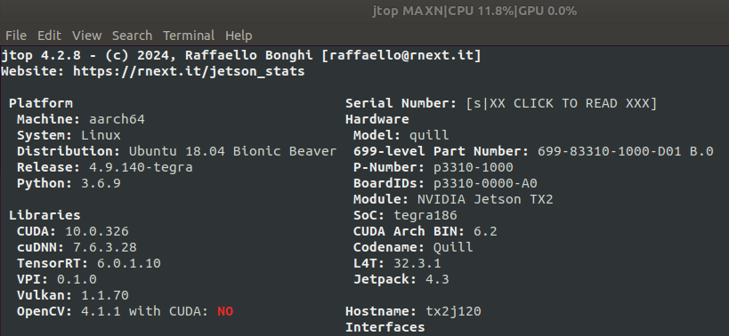

+++
title = '06042024_r200_cam_on_TX2_J120'
date = 2024-06-04T17:46:09-07:00
draft = false
+++

# RealSense R200 on Jetson TX2 with Auvidea J120 carrier board



* Patch Jetpack 4.3 (L4T R32.3.1) with Auvidea [J120 firmware v3.0](https://auvidea.eu/download/firmware/J120/J90-J120-J130_4_3.tar.bz2) according to the README file in the tarball. 
-- As a side note, I cannot get latest v4.0 firmware to work with Jetpack 4.6, both USB ports on J120 boards are not detecting any devices, even mouse/keyboard, so revert to v3.0 firmware. 
-- Even with v3.0 firmware, there are some issues to live with: 1) only the top USB port is 3.0, the bottom USB port is only 2.0; 2) the FAN seems not working (cannot be detected by jtop). 

* Flash the patched L4T to TX2 on J120 board

* Clone librealsense2. 
```
git clone https://github.com/IntelRealSense/librealsense.git
```
As of when this blog is being written, this commit is used:
```
commit ff8a9fb213ec1227394de4060743b0ed61171985 (HEAD -> master, origin/master, origin/HEAD)
Merge: 4673a37d9 488c6ec3e
Author: Eran <librealsense.eran@gmail.com>
Date:   Sun Apr 21 12:01:57 2024 +0300

    PR #12864: Merge v2.55.1 to master

```
* Run permissions script from librealsense2 tot directory.
```
# Need to install v4l-utils first
sudo apt install v4l-utils
./scripts/setup_udev_rules.sh
```

* Build and apply patched kernel modules.
```
./scripts/patch-realsense-ubuntu-L4T.sh
```
Check the log file of this script: ```librealsense.patch.tx2.on.j120.log``` inside this blog github directory.

* Follow section *Run RealSense R200 example apps* of previous blog to R200 examples. 

* Install SDK
```
sudo apt install nvidia-jetpack
```


